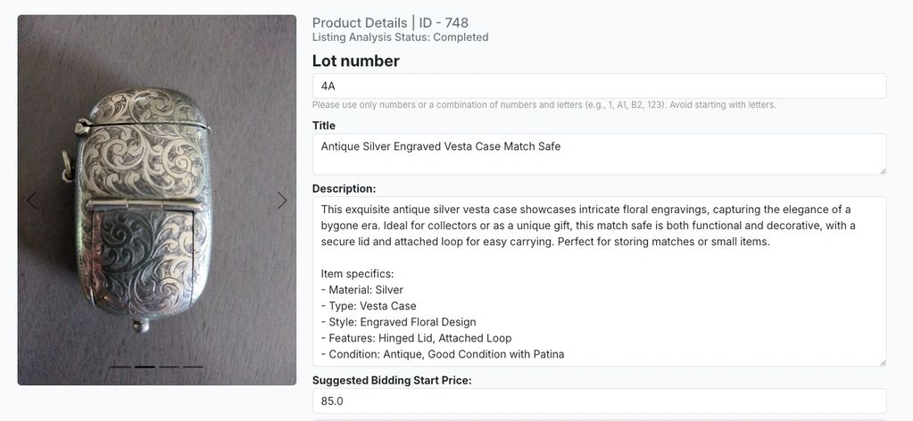

<!-- REVIEW: every statement below is based on the project summary and tech stack. Correct anything that is not accurate, name the AI provider/model if you can, and add numbers (e.g. "listings per hour: 4 → 60") wherever you have them. -->

## The problem

Auction houses and online sellers list hundreds of one-off items: antiques, collectibles, second-hand goods. Each one needs a good title, a detailed description with item specifics, and a sensible starting price — and each marketplace wants the data in a slightly different format.

Writing listings by hand took **hours per batch**, and quality depended on who wrote them.

## What I built

AListEngine turns a few photos into a finished listing:

- **Photo upload.** Sellers upload photos with a category and any seller-specific fields.
- **AI drafting.** AI vision and text models identify the item and draft the title, description, item specifics, and a suggested starting price.
- **Rules engine.** Seller-specific fields and each marketplace's format rules are applied to the draft.
- **Review, then publish.** The seller edits and approves, then exports to Shopify, AuctionFlex, or LiveAuctioneers.

## Key engineering decisions

<!-- REVIEW: keep the ones that match your real reasoning and add any trade-offs you made. -->

- **The AI drafts, a person approves.** Generated listings are always reviewed before export, which keeps quality high and mistakes cheap.
- **Marketplace rules outside the prompt.** Formatting and required fields are enforced by a rules engine, so outputs are consistent and a new marketplace doesn't mean rewriting prompts.
- **One export layer per marketplace.** Each integration maps the same listing to that platform's format, so adding a channel is isolated work.

## Results

- Listing creation dropped from hours to minutes.
- Listing quality is more consistent across sellers and channels.
- Sellers and auction teams can list far more items per day.
